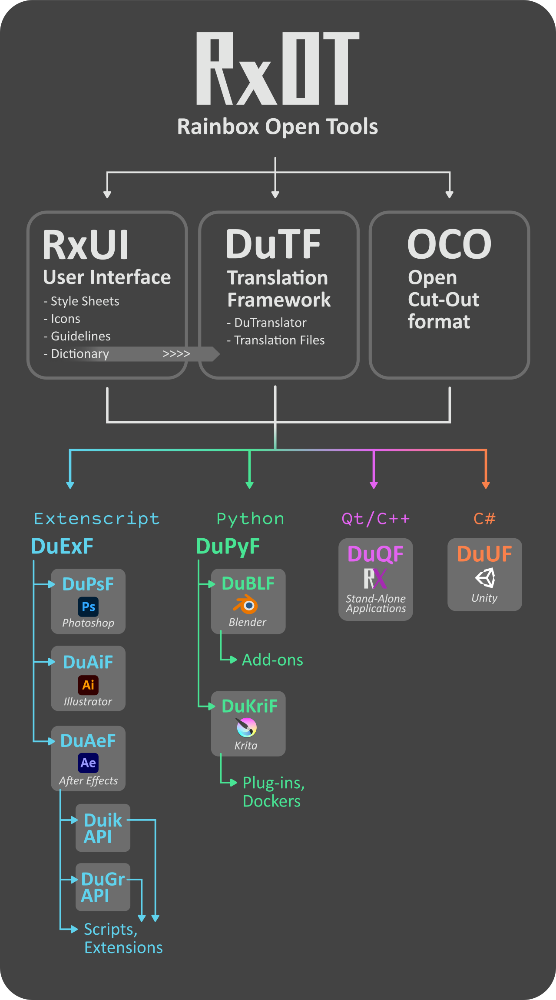

# RxOT
Rx Open Tools for motion pictures production

## Frameworks and tools

- [RxUI](https://github.com/Rainbox-dev/RxUI) (User Interface)
- [DuTF](https://github.com/Rainbox-dev/DuTF) (Internationalization)
- OCO (Open Cut-Out Format)
- DuEXF (ExtendScript - Adobe)
    - DuPsF (Photoshop)
    - DuAiF (Illustrator)
    - [DuAEF](https://github.com/Rainbox-dev/DuAEF) (After Effects)
        - [Duik-Ae](https://github.com/Rainbox-dev/DuAEF_Duik) - Rigging and Animation
        - [DuIO](https://github.com/Rainbox-dev/DuAEF_DuIO) - Import and Export
        - [DuSan](https://github.com/Rainbox-dev/DuAEF_DuSan) - Sanity tests
        - [DuGR](https://github.com/Rainbox-dev/DuAEF_Dugr) - Layer groups
        - [Ramses-Ae](https://github.com/Rainbox-dev/Ramses) - Production and Asset Management
        - [DuME-Ae](https://github.com/Rainbox-dev/DuME) - Media Encoder
- DuPyF (Python)
    - [DuBLF](https://github.com/Rainbox-dev/DuBLF) (Blender)
        - [Duik-Bl](https://github.com/Rainbox-dev/DuBLF_Duik) - Rigging, Animation, Cut-Out and 2D Rigging
        - [Ramses-Bl](https://github.com/Rainbox-dev/Ramses) - Production and Asset Management
    - [DuKriF](https://github.com/Rainbox-dev/DuKRIF) (Krita)
        - [DuExportAnim](https://github.com/Rainbox-dev/DuKRIF_DuExportAnim) - Export animations to JSON+PNG
- DuQF (Qt/C++ stand-alone applications)
    - [DuME](https://github.com/Rainbox-dev/DuME) - Media Encoder
    - [Ramses](https://github.com/Rainbox-dev/Ramses) - Production and Asset Management
- DuUF (C# - Unity)